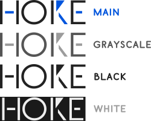
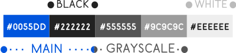
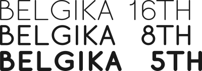

## Table of Content

- [Visual Identity Elements](#visual-identity-elements)
 - [Logo, Symbol and Favicon](#logo-symbol-favicon)
 - [Modifications](#modified-versions)
 - [Color Pallete](#colors)

## Visual Identity Elements
Hoike Visual Identity is constituted by representative Graphic Symbols (Logo, Symbol and Favicon) and its modifications. All of this content is distributed under  [Creative Commons Attribution 4.0 International License](https://creativecommons.org/licenses/by/4.0/legalcode). Be free to use it.

### Logo, Symbol and Favicon
Hoike brand elements (Logo and Symbol) are made up of stylized modifications of the word *Hoike*, formatted as follows:

The Logo size folow the proportions represented below:

The Symbol size follow the proportions represented below.

The Favicon of the project is just the resized and centralized symbol to a square of 32px wide.

### Modified Versions
Hoike representative Graphic Symbols are made up by the following versions:

### Colors
The color pallete used to Hoike Visual Identity elements is shown below:

### Fonts
Hoike brand elements (logo and symbol) were creted upon the [Glacial Indifference Font](https://fontlibrary.org/en/font/glacial-indifference), distributed under [Open Font License](http://scripts.sil.org/cms/scripts/page.php?site_id=nrsi&id=OFL).

The font used in the Visual Identity material exposed here is [Belgika](https://fontlibrary.org/pt/font/belgica-belgika), also distributed under [Open Font License](http://scripts.sil.org/cms/scripts/page.php?site_id=nrsi&id=OFL).

